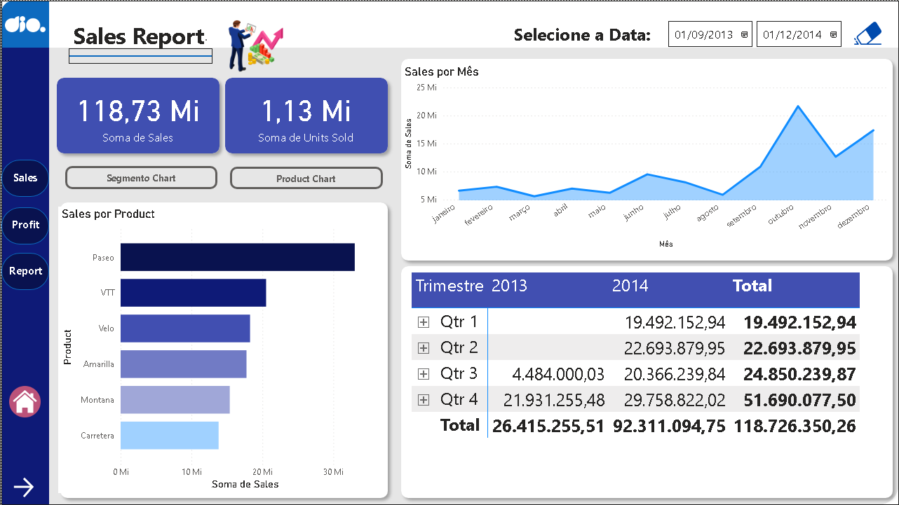
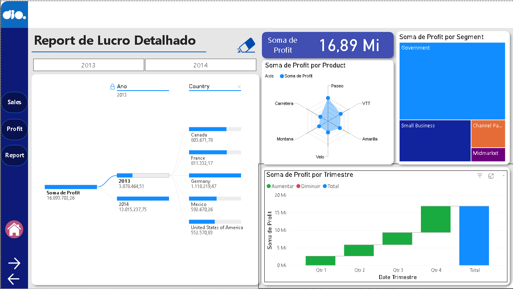
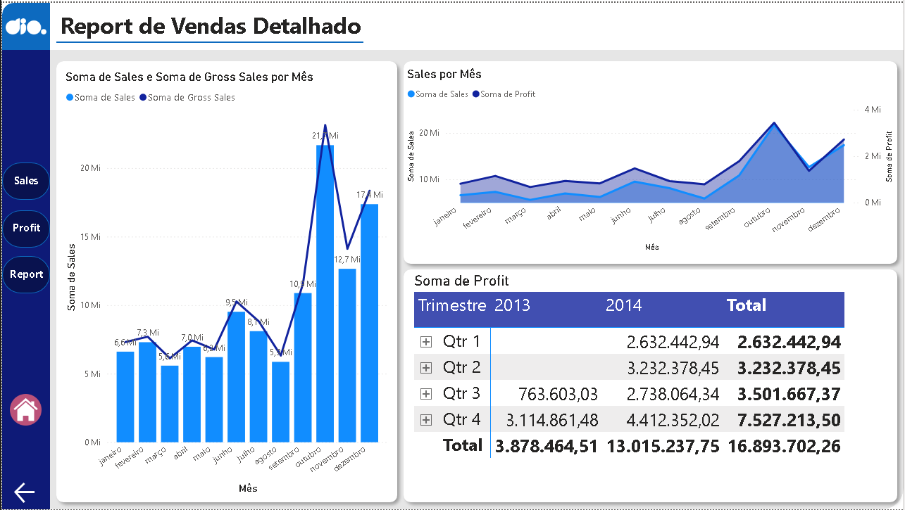

# 📊 Projeto de Dashboard - Atualização

Este repositório contém uma versão atualizada de um projeto anterior de visualização de dados em dashboards interativos. A atualização inclui melhorias visuais, reorganização de elementos e adição de novos recursos de navegação entre páginas.

🔗 **Repositório original**: [Análise de Vendas e Lucro com Power BI](https://github.com/leonardolfa/projeto-relatorio-vendas-power-bi)

## ✨ Principais Atualizações

- Página 1: Remoção de alguns gráficos para melhor foco analítico.
- Página 2: Mantida sem alterações significativas.
- Página 3: Página completamente nova com visualizações inéditas.
- Adição de botões de navegação entre páginas.
- Inclusão de botão "Home" para retorno à página inicial.

---

## 🧭 Navegação

Agora o dashboard conta com botões interativos que permitem transitar entre as páginas com mais fluidez. O botão "Home" leva o usuário diretamente à página inicial, facilitando a usabilidade.

---

## 📄 Página 1 – Relatório de Lucro Detalhado

Esta página apresenta uma análise detalhada dos lucros por país, segmento, produto e trimestre. Em relação à versão anterior, foram removidos alguns gráficos para tornar a visualização mais objetiva e focada.

**Principais elementos:**
- Filtro por ano (exemplo: 2013)
- Lucro total e por país
- Lucro por segmento e produto
- Evolução trimestral com destaque de crescimento

---

## 📄 Página 2 – Relatório de Vendas Detalhado

Esta página permanece com a mesma estrutura e gráficos da versão anterior. Ela oferece uma visão comparativa entre vendas e vendas brutas ao longo dos meses, além de uma tabela de lucros por trimestre.

**Principais elementos:**
- Gráfico de barras: Vendas vs. Vendas Brutas por mês
- Gráfico de linha: Tendência de vendas mensais
- Tabela comparativa de lucros por trimestre (2013 vs. 2014)

---

## 📄 Página 3 – Nova Página: Relatório de Produtos

Esta é a nova adição ao projeto. A página foca na performance de vendas por produto, unidades vendidas e evolução mensal. Também inclui uma tabela de vendas por trimestre.

**Principais elementos:**
- Filtro de data personalizada
- Gráfico de barras: Vendas por produto (ex: Pisco, VIT, Wine, etc.)
- Gráfico de linha: Evolução mensal das vendas
- Tabela de vendas por trimestre (2013 e 2014)

---

